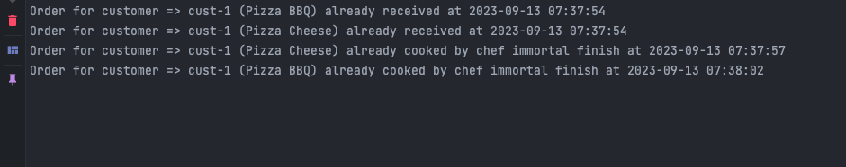

# Pizza Hub
A simple pizza order system. Based on the requirement, it only uses one library.
## Run Locally

Clone the project

```bash
  git clone git@github.com:fwidyatama/shortener-pizza.git
```

Go to the project directory

```bash
  cd pizza-hub
```

Install dependencies

```bash
  go mod tidy
```

Start the server

```bash
  make running-local
```

## Endpoint
| Endpoint  	 | Method   	 | Body / Query (Example)  	    |
|-------------|------------|------------------------------|
| /chef	      | POST   	   | ``` See below example```     |
| /menus  	   | GET   	    | -    	                       |
| /orders  	  | POST   	   | ``` See below example ```  	 |

#### chef body request
```json
{
  "name":"chef-1"
}
```

#### orders body request
```json
[
    {
        "name": "cust-1",
        "type": "Pizza BBQ"
    },
    {
        "name": "cust-1",
        "type": "Pizza Cheese"
    }
]
```


## Result
<p>For see the result, you can see the terminal when you run this program. It's already guarantee that 1 chef only handle 1 order at a time.</p>

 <br>

explanation :
- There are already 1 chef called it "chef immortal". 
- For the Pizza BBQ, waiting time is 5 seconds and for the Pizza cheese is 3 seconds. 
- At 07:37:54 pizza Cheese is ordered, so it will finish at 07:37:57 (3 seconds) 
- Because each chef can only serve one pizza at a time, the 'chef immortal' processes Pizza BBQ at 07:37:57 right after finishing cooking Pizza Cheese and will complete it at 07:38:02 (5 seconds).

## Run Test

To run test, use this following command : 
```bash
  make test
```
